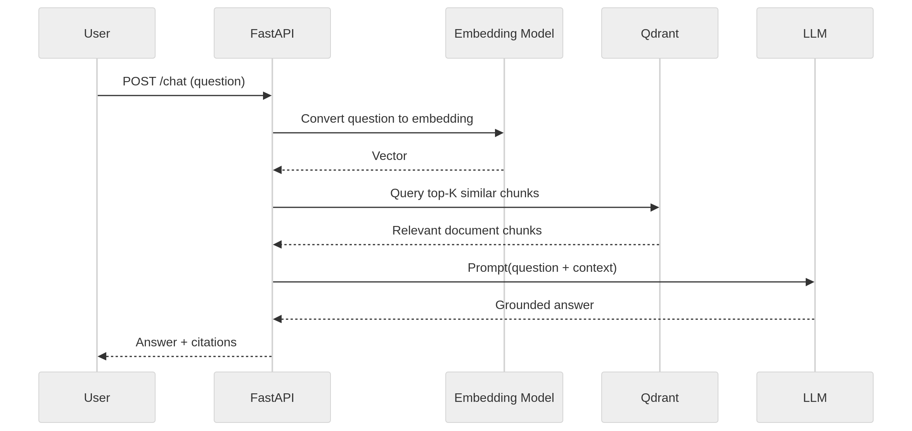

1. Overview

For this assignment, I built a simple but production-minded Retrieval-Augmented Generation (RAG) system that allows users to:

- Upload documents (PDF / TXT / MD)
- Index them into a vector database
- Ask grounded questions
- Receive answers strictly based on document evidence
- Get source citations for traceability

The goal was not to build a flashy UI, but to focus on:

- Clean architecture
- Clear separation of concerns
- Sensible trade-offs
- Production-readiness thinking
- Guardrails to prevent hallucination

I have  intentionally kept the system simple and extensible rather than over-engineering it.

2. Architecture Overview

High-Level Flow

User Question
      ↓
Embedding (OpenAI)
      ↓
Vector Search (Qdrant)
      ↓
Top-K Relevant Chunks
      ↓
LLM (Grounded Prompt)
      ↓
Answer + Sources

System Components

🏗 Architecture Overview

1. API Layer (FastAPI)

Responsible for:

- Document upload
- Index rebuild
- Chat endpoint
- Health check

Why FastAPI?

- Lightweight
- Async-friendly
- Excellent OpenAPI documentation support
- Production-friendly

2. Ingestion Pipeline

Steps:

- Load document
- Extract raw text
- Chunk with overlap
- Generate embeddings
- Store vectors in Qdrant

I separated:
 
 - loaders.py
 - chunking.py
 - indexer.py

This keeps ingestion independent from retrieval.

3. Vector Store (Qdrant)

Why Qdrant?

- Lightweight
- Open-source
- Easy Docker setup
- Strong filtering + metadata support
- Good production scalability path

Each chunk is stored with metadata:

- filename
- chunk_index
- text

This allows traceability and future multi-tenant support.

4. Retrieval Layer

Process:

- Convert question → embedding
- Perform vector similarity search (top_k)
- Retrieve most relevant chunks

Currently using:

- Cosine similarity
- Top-K retrieval

I intentionally did NOT add hybrid search or reranking to keep the core logic clean and explainable.

5. Generation Layer

The LLM is instructed to:

- Use only retrieved context
- Refuse if evidence is insufficient
- Avoid hallucination

If the answer contains refusal language, I clear sources to avoid false confidence.

 ## Key Engineering Decisions

1. Chunking Strategy

- Chunk size: 1200 characters
- Overlap: 200 characters

Why?

- Too small → fragmented meaning
- Too large → poor embedding resolution
- 1200 is a practical balance for business documents
- Overlap helps avoid semantic boundary loss.

## Embedding Model

Model: text-embedding-3-small

Why:

- Strong cost/performance tradeoff
- Good dimensionality for semantic search

## LLM Model

Model: gpt-4o-mini

Why:

- Good instruction following
- Lower cost
- Fast response time
This assignment does not require reasoning-heavy chains, so this model is sufficient.

## Vector Database Choice

Qdrant over:

- FAISS (less API-ready)
- Pinecone (managed, but external dependency)
- Weaviate (heavier setup)

Qdrant offers a good balance of:

- Simplicity
- Local Docker setup
- Production scalability

## Guardrails & Quality Controls

To reduce hallucinations:

- LLM prompt explicitly instructs to answer only from context
- If no relevant chunks → refuse
- If generated answer contains refusal language → sources cleared
- Trace ID added for observability

This ensures grounded generation.

##  Dockerization

The project runs with:

docker compose up --build

## Testing

Current tests:

- Chunking logic

- Loader validation

- Refusal behavior

I intentionally avoided heavy integration tests that require live OpenAI calls to keep tests deterministic.

With more time:

- Add mocked embedding + retrieval tests

- Add evaluation harness with golden dataset

## Productionization Plan (AWS Example)

If deploying to AWS:

- Architecture

- API → ECS or EKS
- Qdrant → Managed cluster or EC2-backed persistent storage
- Documents → S3
- Async indexing → SQS + worker service
- Auth → JWT + tenant isolation
- Rate limiting → API Gateway
- Monitoring → CloudWatch + tracing
- For multi-tenant:
- Use metadata filters in Qdrant
- Namespace collections per customer

## What I Would Improve With More Time

- Add hybrid retrieval (BM25 + vector)
- Add reranker model
- Add streaming responses
- Add evaluation benchmark
- Add prompt injection detection
- Add per-document indexing status tracking
- Add async ingestion queue
- Add token usage monitoring

## . Setup Instructions

1. Create .env

OPENAI_API_KEY=your_key_here
QDRANT_URL=http://qdrant:6333

2. Run
docker compose up --build

3. Open
http://localhost:8000/docs

4. Steps

1) Upload document
2) Rebuild index
3) Ask questions

## Final Thoughts

I focused on building a:

_ Clean
- Minimal
- Extensible
- Production-minded
- RAG system that demonstrates sound engineering decisions rather than unnecessary complexity.

The architecture is intentionally modular so it can evolve into:

- Multi-tenant SaaS
- Async indexing pipeline
- Enterprise-grade AI assistant

